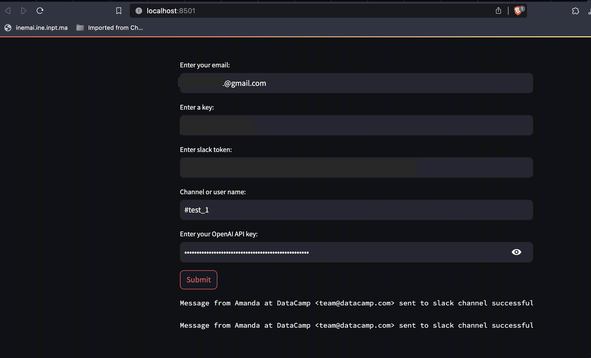

# Email Processing Project

If you're inundated with **emails**, then this project is tailor-made for you!

## Overview
In today's fast-paced world, sifting through long emails can be tedious. Our project aims to alleviate this hassle by processing and summarizing emails, ensuring you get the crux without the fluff.

## Description
Leveraging the power of OpenAI, our application reads through your lengthy emails and provides concise summaries. No more wading through verbose correspondence – get the essential details at a glance. Whether it's for personal use or streamlining business communications, our app ensures you stay on top of your emails efficiently.

## Features
- **Email Summarization**: Get concise summaries of your lengthy emails.
- **OpenAI Integration**: Utilizes advanced AI techniques for accurate and meaningful summaries.
- **User-Friendly Interface**: Simply feed in your emails and get instant summaries.

## Getting Started

### Prerequisites
- An active OpenAI account or API key for integration.

### Setup
1. Clone the repository:
    ```bash
    # Email Processing Project

If you're inundated with **emails**, then this project is tailor-made for you!

## Overview
In today's fast-paced world, sifting through long emails can be tedious. Our project aims to alleviate this hassle by processing and summarizing emails, ensuring you get the crux without the fluff.

## Description
Leveraging the power of OpenAI, our application reads through your lengthy emails and provides concise summaries. No more wading through verbose correspondence – get the essential details at a glance. Whether it's for personal use or streamlining business communications, our app ensures you stay on top of your emails efficiently.

## Features
- **Email Summarization**: Get concise summaries of your lengthy emails.
- **OpenAI Integration**: Utilizes advanced AI techniques for accurate and meaningful summaries.
- **User-Friendly Interface**: Simply feed in your emails and get instant summaries.

## Getting Started

### Prerequisites
- An active OpenAI account or API key for integration.

### Setup
1. Clone the repository:
    ```bash
    gh repo clone abdooussan/email_summary_with_openai
    cd email_summary_with_openai
    ```

2. Follow the installation instructions provided in the `INSTALL.md` or similar documentation within the repository.

### Using the Application
Once set up, simply input or link your emails to the application. Within moments, you'll receive concise summaries, allowing you to grasp the content without reading the entire email.

## Contribution
Feedback, bug reports, and pull requests are welcome. Feel free to fork and contribute to this project.

## License
This project is open source. For more details, please refer to the [LICENSE](LICENSE) file.


    cd [repository_name]
    ```

2. Follow the installation instructions provided in the `INSTALL.md` or similar documentation within the repository.

### Using the Application
Once set up, simply input or link your emails to the application. Within moments, you'll receive concise summaries, allowing you to grasp the content without reading the entire email.

## Contribution
Feedback, bug reports, and pull requests are welcome. Feel free to fork and contribute to this project.

## License
This project is open source. For more details, please refer to the [LICENSE](LICENSE) file.



